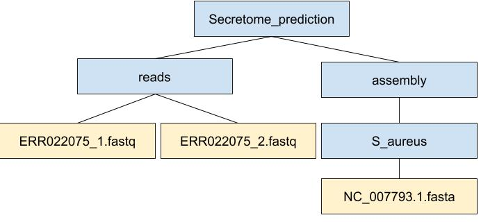

# Pipelines

Let's start to work on the prediction of secreted proteins.

When working with high-throughput sequencing data, the raw reads you get off of the sequencer will need to pass through a number of different tools in order to generate your final desired output. The execution of this set of tools in a specified order is commonly referred to as a workflow or a pipeline.

An example of the workflow we will be using for our secreted protein prediction is provided below with a brief description of each step.

1. Quality control - Trimming and/or filtering reads
2. Assembly of the trimmed reads into contigs
3. Translation of open reading frames, annotation of genes
5. Prediction of secreted proteins

Workflows in bioinformatics adopt a plug-and-play approach in that the output of one tool can be easily
used as input to another tool without any extensive configuration. Having standards for data formats is what 
makes this feasible. Standards ensure that data is stored in a way that is generally accepted and agreed upon 
within the community. The tools that are used to analyze data at different stages of the workflow are therefore 
built under the assumption that the data will be provided in a specific format. 

# Project organization

Project organization is one of the most important parts of a sequencing project, and yet is often overlooked amidst the excitement of getting a first look at new data. Of course, while it’s best to get yourself organized before you even begin your analyses, it’s never too late to start, either.

You should approach your sequencing project similarly to how you do a biological experiment and this ideally begins with experimental design. We’re going to assume that you’ve already designed a beautiful sequencing experiment to address your biological question, collected appropriate samples, and that you have enough statistical power to answer the questions you’re interested in asking. These steps are all incredibly important, but beyond the scope of our course. For all of those steps (collecting specimens, extracting DNA, prepping your samples) you’ve likely kept a lab notebook that details how and why you did each step. However, the process of documentation doesn’t stop at the sequencer!

Genomics projects can quickly accumulate hundreds of files across tens of folders. Every computational analysis you perform over the course of your project is going to create many files, which can especially become a problem when you’ll inevitably want to run some of those analyses again. For instance, you might have made significant headway into your project, but then have to remember the PCR conditions you used to create your sequencing library months prior.

Other questions might arise along the way:

    What were your best alignment results?
    Which folder were they in: Analysis1, AnalysisRedone, or AnalysisRedone2?
    Which quality cutoff did you use?
    What version of a given program did you implement your analysis in?

Good documentation is key to avoiding this issue, and luckily enough, recording your computational experiments is even easier than recording lab data. Copy/Paste will become your best friend, sensible file names will make your analysis understandable by you and your collaborators, and writing the methods section for your next paper will be easy! Remember that in any given project of yours, it’s worthwhile to consider a future version of yourself as an entirely separate collaborator. The better your documenation is, the more this ‘collaborator’ will feel indebted to you!

For this project, some files have been organized already in this directory tree:

We will add more files and directories as we go.

# Trimming and more practice with pipes

Let's use the tools we've added to our tool kit so far, along with a few new ones, to trim short read sequences. 
First, let's navigate to the correct directory.

~~~
$ cd
$ cd ~/Secretome_prediction/reads
$ ls
$ ERR022075_1.fastq  ERR022075_2.fastq
~~~
{: .bash}

These files contain the short read data of *E.coli* K-12 as [paired-end data](https://www.illumina.com/science/technology/next-generation-sequencing/paired-end-vs-single-read-sequencing.html). Before we start to assemble the short reads into contigs, we have to trim the low quality sequences away. 

# Cleaning Reads

It's very common to have some reads within a sample,
or some positions (near the beginning or end of reads) across all
reads that are low quality and should be discarded. We will use a program called
[seqtk](https://github.com/lh3/seqtk) to
filter poor quality reads and trim poor quality bases from our samples.

## Seqtk Options

Seqtk is a program written C and aims to be a Swiss army knife for sequencing reads. 
You don't need to learn C to use Seqtk, but the fact that it's a C program helps
explain the syntax that is used to run Seqtk. The basic
command to run Seqtk starts like this:

~~~
$ seqtk
~~~
{: .bash}

That's just the basic command, however. Seqtk has a variety of
options and parameters. We will need to specify what options we want
to use for our analysis. Here are some of the options:

| option    | meaning |
| ------- | ---------- |
| `seq` | common transformation of FASTA/Q |
|  `comp`   | get the nucleotide composition of FASTA/Q |
|  `trimfq` | trim FASTQ using the Phred algorithm |

In addition to these options, there are a number if  trimming options
available:

~~~
$ seqtk trimfq
~~~
{: .bash}

| step   | meaning |
| ------- | ---------- |
| `-q` | error rate threshold (disabled by -b/-e) [0.05] |
| `-l`  | maximally trim down to INT bp (disabled by -b/-e) [30]  |
|  `-b` |  trim INT bp from left (non-zero to disable -q/-l) [0] |
| `-e`  |  trim INT bp from right (non-zero to disable -q/-l) [0] |

We will use only a few of these options in our
analysis. It is important to understand the steps you are using to
clean your data.

A complete command for trimming with seqtk will look something like this:

~~~
$ seqtk trimfq -q 0.01 RawReads.fastq.gz > Trimmed.fastq
~~~
{: .bash}

Seqtk conveniently de-compresses our fastq file while trimming, which means we do not need the .gz ending anymore.

## Trimming

Now we will run seqtk trimfq on our data. To begin, create the folder that will hold our trimmed data and then navigate to your `untrimmed` data directory:

~~~
$ cd ~/Secretome_prediction
$ mkdir trimmed
$ cd ~/Secretome_prediction/reads
~~~
{: .bash}

We are going to run seqtk on one sample giving it an error rate threshold of 0.01 which indicates the base call accuracy. We request that, after trimming, the chances that a base is called incorrectly are only 1 in 10000.

~~~
$ seqtk trimfq -q 0.01 ERR022075_1.fastq > ~/Secretome_prediction/trimmed/ERR022075_1.trimmed.fastq
~~~
{: .bash}

Notice that we needed to redirect the output to a file. If we don't do that, the trimmed fastq data will be displayed in the console.

> ## Exercise
> Trim the second read pair with the same parameters and write into a new file
> 
> 
> > ## Solution
> > 
> > `$ cd ~/Secretome_prediction/reads`
> > 
> > `$ seqtk trimfq -q 0.01 ERR022075_2.fastq > ~/Secretome_prediction/ERR022075_2.trimmed.fastq`
> >
> {: .solution}
{: .challenge}
