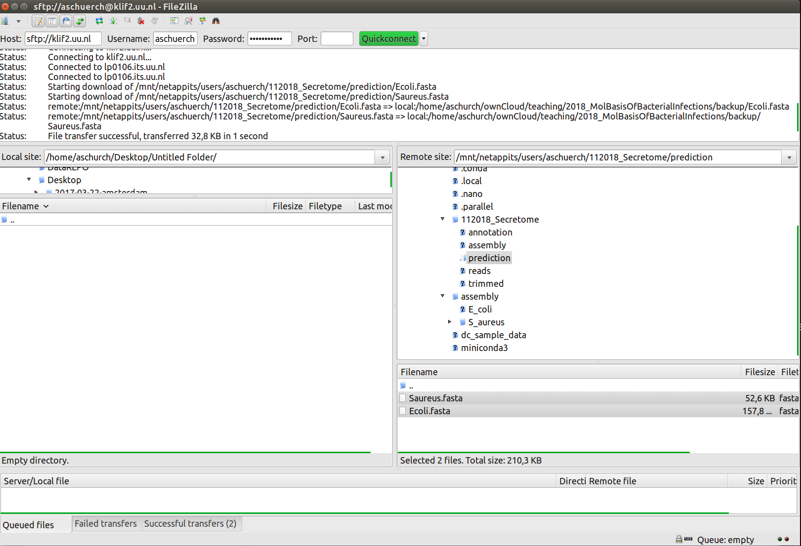

# Protein secretion prediction

SignalP is a neural network–based method which can discriminate signal peptides from transmembrane regions. A signal peptide is the N-terminal part of a protein that is targeted to the secretory pathway in pro- and eukaryotes.  In prokaryotes, translocation takes place across the cytoplasmic membrane (inner membrane in Gram-negative bacteria), and the process can happen during or after translation.

However the presence of a signal peptide does not necessarily mean that the protein is secreted to the extracellular environment—it only means that it enters the secretory pathway. The protein could have one or more transmembrane helices downstream of the signal peptide and therefore be retained in the membrane. In Gram-negative bacteria, the protein could be retained in the periplasm, or be inserted into the outer membrane as a β-barrel transmembrane protein. In Gram-positive bacteria, the protein could be attached to the cell wall. In general signal peptides have three regions: 
 - an N-terminal n-region of variable length characterized by positive charge
 - a central h-region of at least 7 hydrophobic residues\
 - a C-terminal c-region of typically 3-7 polar residues. 
 
Positions –1 and –3 relative to the cleavage site are occupied by small uncharged residues; in bacteria predominantly Alanine. SPs of Gram-positive bacteria tend to be longer than those of Gram-negative bacteria.

# Running signalP

SignalP takes amino acid sequences in fasta format. These are available from the annotation output as .faa files. Note that any letters not corresponding to the twenty standard amino acids, e.g. ‘U’, ‘B’, or ‘Z’, will be converted to ‘X’ and treated as unknown amino acids. Furthermore it is important to choose the correct organism group — Eukaryotes, Gram-negative 
bacteria, or Gram-positive bacteria with the -t option. The -m option will give a fasta output of the mature sequence (after cleavage of the signal peptide).

First, let's make a new folder

~~~
$ cd ~/112018_Secretome
$ mkdir prediction
~~~
{: .bash}

Then, lets run signalP on the *E.coli* proteins

~~~
$ cd ~/112018_Secretome/prediction
$ signalp -t gram- -m Ecoli.fasta  ~/112018_Secretome/annotation/ERR022075/ERR022075.faa
~~~
{: .bash}

> ## Exercise
> 
> Can you find proteins with a signal peptide in the *S.aureus* genome?
>
>
>> ## Solution
>> 
>>  
>> 
>> ~~~ 
>> $ cd ~/112018_Secretome/prediction
>> $ signalp -t gram+ -m Saureus.fasta  ~/112018_Secretome/annotation/S_aureus/S_aureus.faa
>> ~~~
>> {: .bash}
>> {: .output}
> {: .solution}
{: .challenge}

### Moving files between your instance and your laptop

Finally, we need to get results we produced to our own computers.There are also several ways to do this, but it's *always* easier
to start the transfer locally. **This means if you're using a transfer program, it needs to be
installed on your local machine, not on your instance. If you're typing into a terminal,
the terminal should not be logged into your instance, it should be showing your local computer.**

These directions are platform specific so please follow the instructions for your system:

**Please select the platform you wish to use for the exercises: <select id="id_platform" name="platformlist" onchange="change_content_by_platform('id_platform');return false;"><option value="aws_unix" id="id_aws_unix" selected> AWS_UNIX </option><option value="aws_win" id="id_aws_win" selected> AWS_Windows </option></select>**

Program: FileZilla is one of many free FTP clients that allow you to move files between local and remote locations. You can obtain FileZilla at the FileZilla Download page.

When to use:

If you would like a graphical user interface to manage files and folders.

Example Usage:

Instructions here are given for the genomics workshop cloud machines, but the process will be the similar for any remote server. Refer to the screenshot below as you consider the instructions.

Download and install FileZilla
- Enter the location and user credentials of the remote server you are connecting to (section 1) for host enter the machine IP address

- enter your dcuser username and the password for port enter 22
Files on your local computer will be in the highlighted section 2.
- Your Desktop in a folder called 'Users' > 'your computer's username' > and Desktop
Files on your remote computer will be in the highlighted section 3.
- Your Desktop in a folder called 'Users' > 'your computer's username' > and Desktop
Move files between computers by drawing and dropping them in the desired locations.
Tip: You can resize windows in FileZilla for easier viewing.

### Uploading Data to your Virtual Machine

If you're using a PC, we recommend you use the *PSCP* program. This program is from the same suite of
tools as the putty program we have been using to connect.

1. If you haven't done so, download pscp from [http://the.earth.li/~sgtatham/putty/latest/x86/pscp.exe](http://the.earth.li/~sgtatham/putty/latest/x86/pscp.exe)
2. Make sure the *PSCP* program is somewhere you know on your computer. In this case,
your Downloads folder is appropriate.
3. Open the windows [PowerShell](https://en.wikipedia.org/wiki/Windows_PowerShell);
go to your start menu/search enter the term **'cmd'**; you will be able to start the shell
(the shell should start from C:\Users\your-pc-username>).
4. Change to the download directory

~~~
> cd Downloads
~~~
{: .bash}

5. Locate a file on your computer that you wish to upload (be sure you know the path). Then upload it to your remote machine (**you will need to know your ip address, and login credentials**). You will be prompted to enter a password, and then your upload will begin. **(make sure you use substitute 'your-pc-username' for your actual pc username)**

~~~
C:\User\your-pc-username\Downloads> pscp.exe local_file.txt dcuser@ip.address:/home/dcuser/
~~~
{: .bash}

### Downloading Data from your Virtual Machine

1. Follow the instructions in the Upload section to download (if needed) and access the *PSCP* program (steps 1-3)
2. Download the zipped fastqc report using the following command **(make sure you use substitute 'your-pc-username' for your actual pc username and dcuser@ ip.address with your remote login credentials)**

~~~
C:\User\your-pc-username\Downloads> pscp.exe dcuser@ip.address:/home/dcuser/dc_workshop/results/fastqc_untrimmed_reads/SRR097977_fastqc.zip C:\User\your-pc-username\Downloads
~~~
{: .bash}

### scp

`scp` stands for 'secure copy protocol', and is a widely used UNIX tool for moving files
between computers. The simplest way to use `scp` is to run it in your local terminal,
and use it to copy a single file:

~~~
scp <file I want to move> <where I want to move it>
~~~
{: .bash}

Note that you are always running `scp` locally, but that *doesn't* mean that
you can only move files from your local computer. A command like:

~~~
$ scp <local file> <AWS instance>
~~~
{: .bash}

To move it back, you just re-order the to and from fields:

~~~
$ scp <AWS instance> <local file>
~~~
{: .bash}

### Uploading Data to your Virtual Machine

1. Open the terminal and use the `scp` command to upload a file (e.g. local_file.txt) to the dcuser home directory:

~~~
$  scp local_file.txt dcuser@ip.address:/home/dcuser/
~~~
{: .bash}

### Downloading Data from your Virtual Machine

Let's download a zipped file from our remote machine.  You should have a fastqc report in ~/dc_workshop/results/fastqc_untrimmed_reads/SRR097977_fastqc.zip

**Tip:** If you are looking for another (or any really) zip file in your home directory to use instead try

~~~
$ find ~ -name *.zip
~~~
{: .bash}

1. Download the fastqc report in ~/dc_workshop/results/fastqc_untrimmed_reads/SRR097977_fastqc.zip to your home ~/Dowload directory using the following command **(make sure you use substitute dcuser@ ip.address with your remote login credentials)**:

~~~
$ scp dcuser@ip.address:/home/dcuser/dc_workshop/results/fastqc_untrimmed_reads/SRR097977_fastqc.zip ~/Downloads
~~~
{: .bash}

Remember that in both instances, the command is run from your local machine, we've just flipped the order of the to and from parts of the command.

